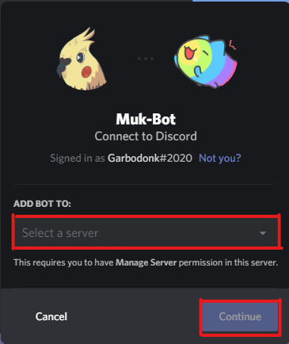
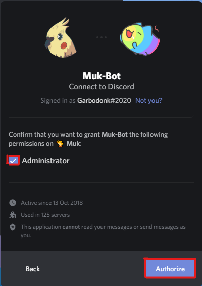
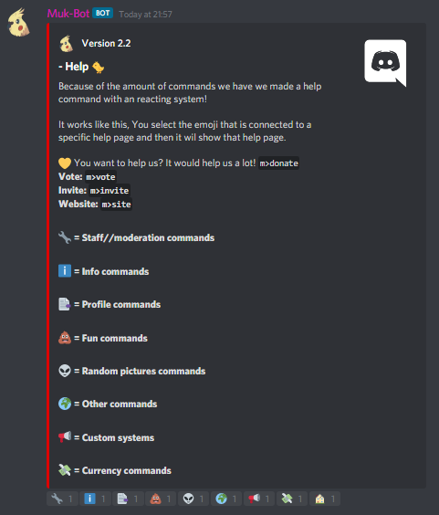

# Guide

## How to set everything up?

Lets start.

Once you're strong enough, save the world:


How to invite the bot?


To invite the bot you [\[click here\]](https://discord.com/oauth2/authorize?client_id=500679403609522186&scope=bot&permissions=8)!

Now you can do the **help** command, To see all our commands


Click on one of the emoji's to go to a different command page.


